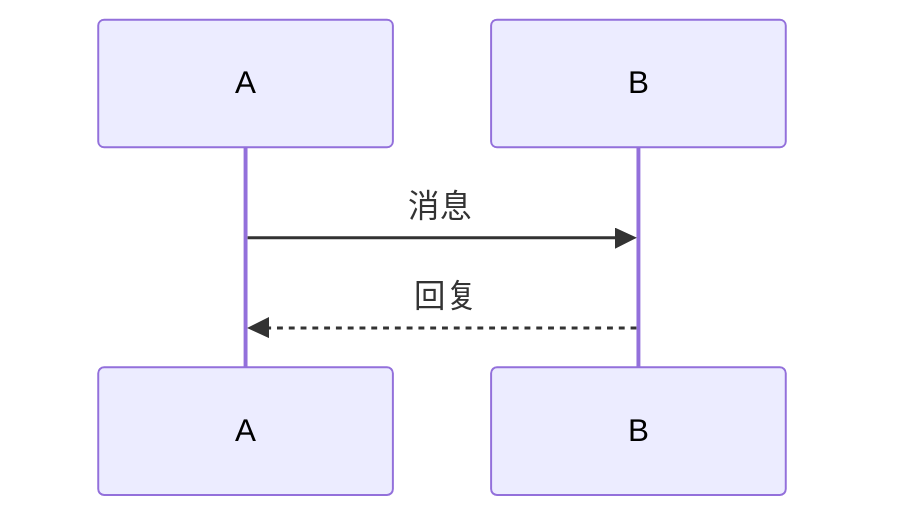

# Steve Blog - 个人博客系统

[](https://stevehe-git.github.io/steve-blog/)
[](https://stevehe-git.github.io/steve-blog/)

> 🌐 **在线访问**: [https://stevehe-git.github.io/steve-blog/](https://stevehe-git.github.io/steve-blog/)

> ⭐ **如果这个项目对你有帮助，请帮忙点个 Star 支持一下！**

一个基于 Vue 3 + TypeScript + Vite 构建的现代化个人博客网站，支持多语言国际化、Markdown 文章渲染、评论功能、主题切换等特性，旨在为个人提供简洁、高效的博客展示平台。

## ✨ 核心特性

- 🌍 **多语言国际化** - 支持中英文等多语言切换，适配全球用户使用场景，可灵活扩展更多语种
- 🎬 **开机动画** - 优雅的开机动画页面，动态打字机效果显示文艺文案，点击任意位置进入主页
- 📝 **Markdown 文章** - 支持 Markdown 格式文章渲染，包括标题、列表、代码块、引用、图片等
- 💬 **评论功能** - 支持文章评论，评论数据本地存储，可扩展后端接口
- 📱 **响应式设计** - 适配桌面端 / 移动端多终端使用，保证不同设备下的操作流畅度
- 🌓 **主题切换** - 支持深色/浅色主题切换，自动保存用户偏好
- 🚀 **高性能** - 基于 Vite 构建，按需加载，极致渲染性能
- 📚 **文章分类** - 支持文章分类筛选和排序功能
- 🔗 **目录导航** - 文章详情页自动生成目录，支持锚点跳转和滚动联动高亮
- 🔍 **文章搜索** - 支持全文搜索，实时高亮匹配结果
- ✏️ **文章编辑** - 支持创建和编辑文章，使用 File System Access API 直接保存为 Markdown 文件，提供封面预设和表单验证
- 📊 **图表支持** - 支持 Mermaid 图表和 Flowchart.js 流程图渲染，支持横向和纵向滚动
- 🧮 **数学公式** - 支持 LaTeX 数学公式渲染（行内和块级）
- 📋 **代码高亮** - 支持多种编程语言的语法高亮，提供一键复制功能，支持横向和纵向滚动
- 🎯 **浮动操作按钮** - 提供快速访问常用功能（主题切换、语言切换、布局切换、阅读模式等），支持 hover 提示
- 📖 **阅读模式** - 专注阅读模式，隐藏导航和侧边栏，提供沉浸式阅读体验
- 📐 **文章视图切换** - 支持列表视图和时间轴视图两种文章展示方式
- 🎨 **布局切换** - 支持单栏/双栏布局切换，单栏布局自动隐藏目录
- 📜 **内容滚动优化** - 代码块、图表容器支持横向和纵向滚动，防止内容溢出屏幕
- 📊 **文章统计信息** - 显示字数统计、预估阅读时间、实际阅读时间、阅读量、评论数等元信息
- 💰 **打赏功能** - 支持打赏功能，点击打赏按钮弹出微信和支付宝二维码，支持上一篇/下一篇导航

## 🛠️ 技术栈

| 技术 | 版本 | 说明 |
|:--------|:-------------|:---------------------|
| Vue | 3.5.24 | 核心前端框架，基于 Composition API 构建 |
| TypeScript | 5.9.3 | 类型安全开发，提升代码可维护性与可读性 |
| Vite | 7.2.4 | 下一代构建工具，实现快速热更新与优化构建 |
| Pinia | 3.0.4 | Vue 官方状态管理库，替代 Vuex，简化状态管理 |
| Vue Router | 4.6.4 | 路由管理，支持动态路由、路由守卫与权限控制 |
| vue-i18n | 9.14.5 | 国际化解决方案，支持语言切换、占位符插值、复数处理 |
| markdown-it | 14.1.0 | Markdown 解析器，支持插件扩展，用于文章内容渲染 |
| highlight.js | 11.10.0 | 代码语法高亮库，支持多种编程语言，集成到 markdown-it 中 |
| katex | 0.16.27 | LaTeX 数学公式渲染库，快速、轻量级，支持行内和块级公式 |
| mermaid | 11.12.2 | 图表和流程图渲染库，支持流程图、时序图、类图等多种图表类型 |
| flowchart.js | 1.18.0 | 流程图渲染库，支持简单的流程图绘制 |
| nanoid | 5.1.6 | 轻量级唯一 ID 生成库，用于文章 ID 生成 |

## 🚀 快速开始

### 环境要求

- **Node.js** ≥ 18.0.0（推荐 18.16.0 LTS 或更高版本）
- **包管理器**：npm
- **浏览器支持**：Chrome 90+、Firefox 88+、Edge 90+、Safari 15+
- **操作系统**：Windows 10+、macOS 10.15+、Linux（Ubuntu 18.04+）

### 本机运行环境

本项目在以下环境中测试通过：

- **Node.js**: v20.19.5
- **npm**: 10.8.2
- **操作系统**: Linux (Ubuntu/Debian)
- **浏览器**: Chrome 120+, Firefox 121+, Edge 120+

> 💡 **提示**：如果使用其他 Node.js 版本，建议使用 [nvm](https://github.com/nvm-sh/nvm) 或 [fnm](https://github.com/Schniz/fnm) 进行版本管理。

### 安装依赖

```bash
# 克隆项目
git clone https://github.com/your-username/steve-blog.git

# 进入项目目录
cd steve-blog

# 安装依赖
npm install
```

### 本地开发

```bash
# 启动开发服务器（自动打开浏览器，支持热更新）
npm run dev

# 访问地址（默认端口5173，若被占用自动切换）
http://localhost:5173
```

### 构建生产

```bash
# 构建生产包（自动优化代码、压缩资源、按需拆分）
npm run build

# 预览生产构建（验证构建结果）
npm run preview
```

### 运行效果

启动开发服务器后，你可以访问以下页面查看效果：

- **开机动画页** (`http://localhost:5173/splash`) - 显示文艺文案，动态打字机效果，点击任意位置进入主页
- **首页** (`http://localhost:5173/home`) - 展示个人介绍、技能、项目、教育经历等
- **文章列表** (`http://localhost:5173/articles`) - 文章列表、分类筛选、搜索功能
- **文章详情** (`http://localhost:5173/articles/:id`) - 文章内容展示、目录导航、评论功能
- **联系页** (`http://localhost:5173/contact`) - 联系方式展示

**运行效果截图说明：**

1. **首页效果**：包含打字机动画、技能展示、项目卡片、教育经历等
2. **文章列表**：支持分类筛选、搜索高亮、排序功能
3. **文章详情**：Markdown 渲染、代码高亮、数学公式、图表支持
4. **响应式设计**：适配桌面端和移动端

> 📸 **提示**：运行 `npm run dev` 后，可以在浏览器中截图保存运行效果。建议截图以下页面：
> - 首页（展示动画效果）
> - 文章列表页（展示筛选和搜索）
> - 文章详情页（展示 Markdown 渲染效果）
> - 移动端响应式效果

## 📖 核心功能使用

### 国际化配置

项目基于 vue-i18n 实现多语言支持，默认支持中英双语，可扩展日语、韩语等更多语种：

- 语言切换即时生效，自动缓存用户偏好到本地存储
- 支持模板插值、复数形式、日期 / 数字格式化
- 支持组件内、全局、工具函数中多场景使用

**扩展新语言：**

1. 在 `src/locales/` 目录下新增语言文件（如 `ja.json` 日语）
2. 在 `src/i18n.ts` 中注册新语言
3. 在 `src/App.vue` 中添加语言切换逻辑

### 文章管理

项目使用 Markdown 文件作为文章来源，将 Markdown 文件放在项目根目录的 `content/` 目录下，系统会自动加载并显示。

**文件格式：**

支持可选的 YAML frontmatter：

```markdown
---
title: 文章标题
description: 文章描述
categoryKey: c/c++
tag: C++
badge: New
date: 2025-12-16
updatedDate: 2025-12-17
platform: Wechat
cover: "linear-gradient(135deg, #667eea 0%, #764ba2 100%)"
articleId: 65a71ab1-e1ce-479c-be0c-f1dd21255a1e
---

# 文章内容

这里是 Markdown 格式的文章内容...
```

**Frontmatter 字段说明：**

- `title`: 文章标题（必填，如未提供则从文件名提取）
- `description`: 文章描述（必填，如未提供则从内容第一段提取）
- `categoryKey`: 文章分类（必填，从国际化配置动态加载，如 `c/c++`, `linux`, `ROS`, `中间件`, `apollo` 等），默认：`c/c++`
- `tag`: 文章标签（必填）
- `badge`: 可选徽章（如 "Beta", "New" 等）
- `date`: 创建日期（必填，YYYY-MM-DD 格式，如未提供则从文件名提取或使用当前日期）
- `updatedDate`: 更新日期（可选，YYYY-MM-DD 格式）
- `platform`: 发布平台（必填，默认：Wechat）
- `cover`: 封面背景（必填，支持 CSS 渐变如 `"linear-gradient(...)"` 或图片 URL/base64 如 `data:image/...`，建议使用引号包裹）
- `articleId`: 文章唯一标识（可选，UUID 格式，系统会自动生成，用于文章编辑时识别文件）

**文件名格式：**

- `YYYY-MM-DD-title.md` - 包含日期和标题
- `title.md` - 仅包含标题

**特性：**

- ✅ 自动读取 `content/` 目录下的所有 `.md` 文件
- ✅ 支持 YAML frontmatter
- ✅ 从文件名自动提取日期和标题
- ✅ 自动提取文章描述（从内容第一段）
- ✅ 按日期自动排序（最新的在前）
- ✅ 构建时自动打包到构建产物中
- ✅ 构建时自动复制到 `dist/content` 目录
- ✅ 支持封面图片上传（base64 格式）
- ✅ 支持封面 CSS 渐变背景
- ✅ 分类从国际化配置动态加载

**文章操作：**

- **创建文章**：访问 `/articles/new` 或点击"新建文章"按钮
  - 填写文章信息（标题、描述、分类、标签、日期等）
  - 选择或上传封面图片（支持 base64 格式，最大 5MB）
  - 输入 Markdown 内容
  - 点击"发布"按钮，使用文件保存对话框保存为 Markdown 文件
  - 文件自动保存到用户选择的目录（建议保存到项目的 `content/` 目录）

- **编辑文章**：在文章详情页点击"编辑"按钮，或访问 `/articles/:id/edit`
  - 修改文章信息
  - 更新 Markdown 内容
  - 点击"更新"按钮，直接更新对应的 Markdown 文件（无感触发，无需重新选择文件）

**技术特性：**

- ✅ 使用 **File System Access API**（需要 Chrome、Edge 或 Opera 浏览器）
- ✅ 支持文件保存对话框，用户可选择保存位置
- ✅ 编辑模式下自动记住文件位置，更新时无需重新选择
- ✅ 自动生成文件名（基于文章标题和日期）
- ✅ 支持自定义文件名
- ✅ 表单验证（标题、描述、内容、分类、标签、日期、平台、封面必填）
- ✅ 封面图片上传（支持 base64 格式，最大 5MB）
- ✅ 封面预设（6 种 CSS 渐变背景）

### 如何将 Markdown 文档显示在博客系统中

#### 方法一：直接复制 Markdown 文件（推荐）

1. **准备 Markdown 文件**
   - 将你的 Markdown 文件准备好（可以包含 frontmatter 或纯 Markdown 内容）

2. **复制到 content 目录**
   ```bash
   # 将你的 .md 文件复制到项目的 content/ 目录
   cp /path/to/your/article.md ./content/
   
   # 或者手动将文件复制到 content/ 目录
   ```

3. **添加 Frontmatter（可选但推荐）**
   
   在文件开头添加 YAML frontmatter：
   ```markdown
   ---
   title: 你的文章标题
   description: 文章描述
   categoryKey: c/c++
   tag: 标签
   badge: New
   date: 2025-12-17
   updatedDate: 2025-12-18
   platform: Wechat
   cover: "linear-gradient(135deg, #667eea 0%, #764ba2 100%)"
   articleId: 65a71ab1-e1ce-479c-be0c-f1dd21255a1e
   ---
   
   # 你的文章内容
   
   这里是 Markdown 内容...
   ```
   
   **Frontmatter 字段说明：**
   - `title`: 文章标题（必填）
   - `description`: 文章描述（必填）
   - `categoryKey`: 文章分类（必填，从国际化配置动态加载，如 `c/c++`, `linux`, `ROS`, `中间件`, `apollo` 等）
   - `tag`: 文章标签（必填）
   - `badge`: 可选徽章（如 "New", "Beta" 等）
   - `date`: 创建日期（必填，YYYY-MM-DD 格式）
   - `updatedDate`: 更新日期（可选，YYYY-MM-DD 格式）
   - `platform`: 发布平台（必填，默认：Wechat）
   - `cover`: 封面背景（必填，支持 CSS 渐变如 `"linear-gradient(...)"` 或图片 URL/base64，建议使用引号包裹）
   - `articleId`: 文章唯一标识（可选，UUID 格式，系统会自动生成）

4. **重启开发服务器**
   ```bash
   # 如果开发服务器正在运行，需要重启以加载新文章
   # 按 Ctrl+C 停止，然后重新运行
   npm run dev
   ```

5. **查看效果**
   - 访问 `http://localhost:5173/articles` 查看文章列表
   - 点击文章查看详情页

#### 方法二：使用文章编辑页面创建

1. **访问新建文章页面**
   - 启动开发服务器后，访问 `http://localhost:5173/articles/new`
   - 或点击文章列表页的"新建文章"按钮

2. **填写文章信息**
   - 填写标题、描述、分类、标签、日期等信息
   - 选择或上传封面图片
   - 在内容区域输入或粘贴 Markdown 内容

3. **保存文章**
   - 点击"发布"按钮
   - 系统会自动将文章保存为 Markdown 文件到 `content/` 目录
   - 文件名格式：`YYYY-MM-DD-title.md`

4. **效果截图**

以下是博客系统的运行效果截图：

#### 开机动画页 (Splash Page)


开机动画页显示文艺文案，使用动态打字机效果逐句显示，点击任意位置进入主页。支持深色/浅色主题切换，与主页样式保持一致。

#### 首页 (Home Page)


首页展示个人介绍、技能、项目经历和教育背景，包含打字机动画、滚动触发动画等交互效果。

#### 文章列表页 (Articles Page)


文章列表页支持分类筛选、搜索高亮、排序等功能，展示所有文章的卡片式布局。

#### 文章详情页 (Article Detail Page)


文章详情页展示完整的 Markdown 渲染内容，包括代码高亮、数学公式、图表等，右侧自动生成目录导航。

#### 文章编辑页 (Article Edit Page)


文章编辑页提供完整的表单编辑功能，支持封面图片上传、分类选择、内容编辑等。

#### 联系页 (Contact Page)


联系页展示联系方式，包括 GitHub、微信、电话、邮箱等信息，支持国际化切换。

#### 方法三：批量导入文章

如果你有多个 Markdown 文件需要导入：

```bash
# 批量复制文件到 content 目录
cp /path/to/your/articles/*.md ./content/

# 或者使用 find 命令查找并复制
find /path/to/your/articles -name "*.md" -exec cp {} ./content/ \;
```

**注意事项：**

- ✅ 确保文件名不重复（系统会根据文件名生成唯一 ID）
- ✅ 建议使用 `YYYY-MM-DD-title.md` 格式命名，便于排序和管理
- ✅ 如果 Markdown 文件包含图片，需要将图片路径改为相对路径或使用 base64
- ✅ 支持 GitHub Flavored Markdown (GFM) 语法
- ✅ 支持代码块、表格、任务列表、数学公式、图表等扩展语法

### Markdown 渲染

项目使用 markdown-it 插件进行 Markdown 解析，支持以下语法：

#### 基础语法

- **标题**（H1-H6，自动生成锚点 ID）
- **无序列表**和**有序列表**
- **引用块**
- **代码块**（支持语言标识，使用 highlight.js 进行语法高亮，支持一键复制）
- **行内代码**
- **粗体**、*斜体*文本
- **图片**（自动适配响应式）
- **链接**（自动识别 URL）
- **HTML 标签**（可选）
- **删除线**、**高亮标记**（`==标记文本==`）
- **表格**（带边框样式）
- **任务列表**（checkbox）

#### LaTeX 数学公式支持

项目使用 KaTeX 渲染 LaTeX 数学公式，支持行内公式和块级公式：

**行内公式**（使用单个 `$` 包裹）：
```markdown
这是一个行内公式：$E = mc^2$
```

**块级公式**（使用双 `$$` 包裹）：
```markdown
$$
\int_{-\infty}^{\infty} e^{-x^2} dx = \sqrt{\pi}
$$
```

**常用数学符号示例：**
- 分数：`$\frac{a}{b}$` → $\frac{a}{b}$
- 根号：`$\sqrt{x}$` → $\sqrt{x}$
- 上标和下标：`$x^2$`、`$x_i$` → $x^2$、$x_i$
- 求和：`$\sum_{i=1}^{n} x_i$` → $\sum_{i=1}^{n} x_i$
- 积分：`$\int_{a}^{b} f(x) dx$` → $\int_{a}^{b} f(x) dx$
- 矩阵：`$\begin{pmatrix} a & b \\ c & d \end{pmatrix}$`

更多语法请参考 [KaTeX 官方文档](https://katex.org/docs/supported.html)。

#### Mermaid 图表支持

项目支持 Mermaid 图表渲染，可以在 Markdown 中使用以下代码块语法：

````markdown

````

**支持的图表类型：**
- `mermaid` - 通用 Mermaid 图表
- `sequenceDiagram` - 时序图
- `classDiagram` - 类图
- `stateDiagram` - 状态图
- `erDiagram` - ER图
- `journey` - 用户旅程图
- `gantt` - 甘特图
- `pie` - 饼图
- `requirement` - 需求图
- `gitgraph` - Git 图
- `mindmap` - 思维导图
- `timeline` - 时间线

**图表特性：**
- ✅ 自动识别 `language-mermaid` 等格式，避免被当作普通代码处理
- ✅ 支持主题切换（深色/浅色模式自动适配）
- ✅ 支持横向和纵向滚动（最大高度 600px）
- ✅ 响应式宽度，自动适应容器

#### Flowchart.js 流程图支持

项目支持 Flowchart.js 流程图渲染，可以在 Markdown 中使用以下代码块语法：

````markdown
```flowchart
st=>start: 开始
e=>end: 结束
op=>operation: 操作
cond=>condition: 条件判断
st->op->cond
cond(yes)->e
cond(no)->op
```
````

**流程图语法：**
- `st=>start: 开始` - 开始节点
- `e=>end: 结束` - 结束节点
- `op=>operation: 操作` - 操作节点
- `cond=>condition: 条件判断` - 条件节点
- `io=>inputoutput: 输入输出` - 输入输出节点
- `sub=>subroutine: 子程序` - 子程序节点

**流程图特性：**
- ✅ 自动识别 `language-flowchart` 等格式，避免被当作普通代码处理
- ✅ 支持主题切换（深色/浅色模式自动适配）
- ✅ 支持横向和纵向滚动（最大高度 600px）
- ✅ 响应式宽度，自动适应容器

更多语法请参考 [Flowchart.js 官方文档](https://flowchart.js.org/)。

### 评论功能

评论功能使用本地存储（localStorage）保存数据，可按文章 ID 分组管理。支持：

- 添加评论（昵称可选）
- 查看评论列表
- 评论时间显示
- 评论数据持久化

**扩展为后端 API：**

只需修改 `src/composables/useArticleComments.ts` 中的实现，将 localStorage 操作替换为 API 调用即可。

### 文章统计信息

项目提供详细的文章统计信息，帮助读者了解文章的基本情况：

**显示内容：**

- **发布日期**：📅 发表于（文章创建日期）
- **更新日期**：🔄 更新于（文章最后更新日期，可选）
- **分类标签**：💻 文章分类/标签
- **字数统计**：📄 字数总计（自动计算，去除 Markdown 语法）
- **预估阅读时间**：⏱️ 预估阅读（基于字数计算，默认 300 字/分钟）
- **实际阅读时间**：⏰ 实际阅读（从进入页面开始计时，页面隐藏时暂停）
- **阅读量**：👁️ 阅读量（使用 localStorage 存储，支持跨标签页同步）
- **评论数**：💬 评论（实时显示文章评论数量）

**技术特性：**

- ✅ 字数统计自动去除 Markdown 语法（代码块、链接、图片等）
- ✅ 中英文混合计算（中文按字，英文按单词）
- ✅ 实际阅读时间实时更新（每秒更新一次）
- ✅ 页面可见性检测（页面隐藏时暂停计时）
- ✅ 阅读量自动统计（页面加载时自动增加）
- ✅ 评论数实时同步（支持跨标签页和同标签页更新）
- ✅ 阅读模式下自动居中显示

**组件位置：**

- `src/components/article/ArticleMeta.vue` - 文章元信息组件
- `src/utils/articleStats.ts` - 文章统计工具函数

### 打赏功能

项目支持打赏功能，方便读者对作者进行支持：

**功能特性：**

- **打赏按钮**：蓝色打赏按钮，位于文章内容下方、评论区域上方
- **二维码弹窗**：点击打赏按钮弹出模态框，显示微信和支付宝二维码
- **上一篇/下一篇导航**：深色渐变横幅，显示相邻文章标题，点击可快速跳转

**打赏模态框：**

- 半透明遮罩层背景
- 淡入和上滑动画效果
- 关闭按钮（右上角 ×）
- 点击遮罩层可关闭
- 响应式设计，移动端自动适配
- 二维码并排显示（桌面端）或垂直排列（移动端）

**配置说明：**

1. 将微信二维码图片命名为 `weixin.jpg`，放在 `content/` 目录下
2. 将支付宝二维码图片命名为 `zhifubao.jpg`，放在 `content/` 目录下
3. 构建时会自动复制到 `dist/content/` 目录

**组件位置：**

- `src/components/article/ArticleReward.vue` - 打赏组件

### 主题切换

项目支持深色/浅色主题切换，主题状态通过 Pinia 管理，自动保存到本地存储。

**主题切换方式：**
- 点击导航栏右侧的主题切换按钮（☀/☾）
- 点击浮动操作按钮中的主题切换按钮（带 hover 提示）
- 主题状态会自动保存到 localStorage
- 页面刷新后自动恢复上次选择的主题

### 目录导航（TOC）

文章详情页自动生成目录导航，支持以下功能：

- **自动生成目录**：根据文章标题（H1-H6）自动生成目录结构
- **锚点跳转**：点击目录项可平滑滚动到对应标题位置
- **滚动联动高亮**：滚动文章时，目录中对应的标题会自动高亮显示
- **自动滚动**：目录容器会自动滚动，确保当前激活的目录项始终可见
- **布局适配**：单栏布局时自动隐藏目录，双栏布局时显示在右侧
- **响应式设计**：移动端自动隐藏目录，桌面端显示

### 阅读模式

项目支持专注阅读模式，提供沉浸式阅读体验：

- **进入阅读模式**：点击浮动操作按钮中的阅读模式按钮，或使用快捷键
- **阅读模式特性**：
  - 隐藏导航栏和侧边栏
  - 隐藏文章卡片的多余元素（封面、标签、元信息等）
  - 优化内容区域布局，最大宽度 800px，居中显示
  - 增大字体和行高，提升阅读体验
  - 隐藏评论区域（可选）
  - 提供"退出阅读模式"按钮，随时退出
- **响应式优化**：阅读模式下移动端自动调整字体大小和间距

### 文章视图和布局

项目支持多种文章展示方式：

- **视图模式切换**：
  - **列表视图**：卡片式布局，展示文章封面、标题、描述等信息
  - **时间轴视图**：按年份分组，时间轴式展示，适合按时间浏览文章
  - 通过浮动操作按钮切换视图模式，自动保存用户偏好

- **布局切换**：
  - **单栏布局**：文章内容全宽显示，自动隐藏目录
  - **双栏布局**：文章内容 + 目录导航，适合长文章阅读
  - 通过浮动操作按钮切换布局，自动保存用户偏好

### 内容滚动优化

项目对代码块、图表容器等进行了滚动优化：

- **代码块滚动**：
  - 支持横向滚动（长代码行）
  - 支持纵向滚动（代码块高度超过 500px 时）
  - 自定义滚动条样式，适配深色/浅色主题
  - 响应式宽度，自动适应容器宽度

- **图表容器滚动**：
  - Mermaid 图表容器支持横向和纵向滚动（最大高度 600px）
  - Flowchart 流程图容器支持横向和纵向滚动（最大高度 600px）
  - 自定义滚动条样式

- **内容宽度优化**：
  - `.content-block` 容器自动适应父容器宽度，不会超出屏幕
  - 防止横向溢出，确保所有内容在屏幕范围内显示
  - 支持内容换行，提升移动端体验

### 文章搜索

项目支持全文搜索功能，可以搜索文章标题、描述、内容、标签和分类。

**搜索特性：**
- 实时搜索，输入即搜索
- 高亮显示匹配结果
- 支持中文和英文搜索
- 搜索关键词会在标题和描述中高亮显示

## 📁 目录结构

```
steve-blog/
├── content/              # Markdown 文章文件目录
│   ├── 2025-12-22-mardown.md
│   ├── 2025-12-25-yolo.md
│   ├── 2025-12-27-swap.md
│   ├── 2025-12-28-超长文本.md
│   ├── weixin.jpg        # 微信打赏二维码
│   └── zhifubao.jpg      # 支付宝打赏二维码
├── dist/                 # 构建输出目录（生产环境）
│   ├── assets/           # 打包后的静态资源
│   ├── content/          # 构建时复制的文章文件
│   ├── 404.html          # 404错误页面
│   ├── blog.svg          # 网站图标
│   └── index.html        # 入口 HTML
├── image/                # 项目效果截图目录
│   ├── articles.png      # 文章列表页效果截图
│   ├── contact.png       # 联系页效果截图
│   ├── detail.png        # 文章详情页效果截图
│   ├── edit.png          # 文章编辑页效果截图
│   └── home.png          # 首页效果截图
├── public/               # 静态资源（不会被Vite处理，直接复制到dist）
│   ├── 404.html          # 404错误页面
│   └── blog.svg          # 网站图标
├── src/
│   ├── assets/           # 静态资源（图片、样式、字体等，会被Vite处理）
│   │   └── vue.svg       # Vue Logo
│   ├── components/       # 通用组件
│   │   ├── article/      # 文章相关组件
│   │   │   ├── ArticleHeader.vue      # 文章头部组件（标题、元信息、操作按钮）
│   │   │   ├── ArticleContent.vue      # 文章内容组件（Markdown渲染、代码高亮）
│   │   │   ├── ArticleTOC.vue           # 目录导航组件（自动生成目录，支持滚动联动高亮）
│   │   │   ├── ArticleMeta.vue          # 文章元信息组件（字数、阅读时间、阅读量、评论数）
│   │   │   ├── ArticleReward.vue        # 打赏组件（打赏按钮、二维码弹窗、上一篇/下一篇导航）
│   │   │   ├── CodeBlock.vue           # 代码块组件（代码高亮、一键复制）
│   │   │   └── CommentSection.vue      # 评论区域组件（评论列表、添加评论）
│   │   ├── home/         # 首页相关组件
│   │   │   ├── Section.vue             # 通用区块组件（带滚动动画）
│   │   │   ├── Card.vue                # 通用卡片组件（支持多种动画类型）
│   │   │   ├── SkillCategory.vue       # 技能分类组件
│   │   │   ├── ProjectCard.vue         # 项目卡片组件
│   │   │   └── EducationCard.vue        # 教育经历卡片组件
│   │   ├── ArticleListView.vue         # 文章列表视图组件
│   │   ├── TimelineView.vue             # 时间轴视图组件
│   │   ├── Pagination.vue               # 分页组件
│   │   └── FloatingActionButtons.vue   # 浮动操作按钮组件（主题切换、语言切换、布局切换、阅读模式等）
│   ├── composables/      # 组合式函数（逻辑复用）
│   │   ├── useArticleMarkdown.ts       # Markdown 解析逻辑（代码高亮、数学公式、图表识别）
│   │   ├── useArticleComments.ts       # 评论管理逻辑（本地存储）
│   │   ├── useArticleEditor.ts         # 文章编辑逻辑（创建、更新、验证、File System Access API）
│   │   ├── useArticleSearch.ts         # 文章搜索逻辑（全文搜索、高亮）
│   │   ├── useCategories.ts            # 分类管理逻辑（从国际化配置动态加载）
│   │   ├── useCodeCopy.ts              # 代码复制功能
│   │   ├── useMermaidRenderer.ts       # Mermaid 图表渲染（主题适配、重新渲染）
│   │   └── useFlowchartRenderer.ts     # Flowchart 流程图渲染（主题适配、重新渲染）
│   ├── data/            # 数据文件
│   │   ├── types.ts                    # 文章类型定义
│   │   ├── contentArticles.ts          # 内容文章管理（Markdown文件加载）
│   │   └── index.ts                    # 统一导出和合并接口
│   ├── locales/         # 国际化语言文件
│   │   ├── zh.json                     # 中文语言包
│   │   └── en.json                      # 英文语言包
│   ├── pages/           # 页面组件
│   │   ├── SplashPage.vue              # 开机动画页（文艺文案、动态打字机效果）
│   │   ├── HomePage.vue                # 首页（个人介绍、技能、项目、教育）
│   │   ├── ArticlesPage.vue            # 文章列表页（分类筛选、搜索、排序、视图切换）
│   │   ├── ArticleDetailPage.vue        # 文章详情页（内容展示、评论、导航、阅读模式）
│   │   ├── ArticleEditPage.vue         # 文章编辑页（创建/编辑文章、表单验证）
│   │   └── ContactPage.vue             # 联系页（联系方式展示）
│   ├── router/          # 路由配置
│   │   └── index.ts                    # 路由定义（路径、组件、重定向）
│   ├── store/           # Pinia状态管理
│   │   ├── modules/     # 模块状态
│   │   │   └── app.ts                  # 应用状态（主题切换、视图模式、布局、阅读模式）
│   │   └── index.ts                    # Pinia实例创建
│   ├── styles/          # 样式文件
│   │   └── markdown-content.css        # Markdown 内容样式（代码块、表格、图表、滚动优化）
│   ├── utils/           # 工具函数
│   │   ├── html.ts                     # HTML转义工具（XSS防护）
│   │   ├── frontmatter.ts              # Frontmatter 解析工具
│   │   ├── markdownLoader.ts           # Markdown 文件加载器
│   │   ├── markdownExporter.ts         # Markdown 文件导出工具
│   │   ├── coverStyle.ts               # 封面样式工具（处理CSS渐变和图片）
│   │   └── articleStats.ts             # 文章统计工具（字数统计、阅读时长、阅读量）
│   ├── App.vue          # 根组件（导航栏、路由视图、主题切换）
│   ├── main.ts          # 入口文件（初始化Vue、路由、Pinia、i18n）
│   ├── i18n.ts          # 国际化配置
│   ├── style.css        # 全局样式（主题变量、布局、组件样式、阅读模式）
│   └── vite-env.d.ts    # Vite 类型声明文件
├── vite-plugin-copy-content.ts  # Vite 插件：构建时复制 content 目录
├── vite-env.d.ts        # Vite 类型声明文件（@vitejs/plugin-vue 类型定义）
├── .eslintrc.js         # ESLint配置（代码规范）
├── .prettierrc.js       # Prettier配置（代码格式化）
├── tsconfig.json        # TypeScript配置
├── tsconfig.app.json    # TypeScript应用配置
├── tsconfig.node.json   # TypeScript Node配置
├── vite.config.ts       # Vite配置（插件、别名、构建优化、代码分割）
├── package.json         # 依赖配置与脚本命令
└── README.md            # 项目说明文档（本文档）
```

## 🗺️ 页面路由

| 路径 | 名称 | 说明 |
|:-----|:-----|:-----|
| `/` | - | 重定向到 `/splash`（开机动画页） |
| `/splash` | splash | 开机动画页（显示文艺文案，动态打字机效果） |
| `/home` | home | 首页 |
| `/articles` | articles | 文章列表页（支持分类筛选、搜索、排序） |
| `/articles/:id` | articleDetail | 文章详情页（显示文章内容、评论、目录） |
| `/articles/new` | articleNew | 新建文章页 |
| `/articles/:id/edit` | articleEdit | 编辑文章页 |
| `/contact` | contact | 联系页 |

## 💻 开发规范

### 代码风格

- 遵循 ESLint + Prettier 配置，提交前自动格式化
- 使用 2 空格缩进
- 使用单引号
- 行尾不加分号（由 Prettier 自动处理）

### TypeScript

- 强制使用类型定义，避免 `any` 类型（特殊情况需注释说明）
- 使用接口（interface）定义对象类型
- 使用类型别名（type）定义联合类型
- 优先使用组合式 API（Composition API）
- 类型声明文件：项目根目录的 `vite-env.d.ts` 用于声明第三方库的类型（如 `@vitejs/plugin-vue`）

### 组件开发

- 通用组件需编写文档注释，支持 Props 类型校验与默认值
- 组件命名使用 PascalCase
- 保持组件职责单一，复杂页面拆分为多个子组件
- 使用 `<script setup>` 语法

### 国际化

- 所有用户可见文本必须通过 `$t()` 函数，禁止硬编码
- 新增文本需要在 `src/locales/zh.json` 和 `src/locales/en.json` 中同时添加
- 使用命名空间组织翻译文本（如 `nav.home`, `article.title`）

### 样式规范

- 使用 CSS 变量定义主题颜色
- 使用 scoped 样式避免样式污染
- 响应式设计使用媒体查询
- 优先使用 Flexbox 和 Grid 布局

### Git 提交规范

- 使用有意义的提交信息
- 提交前运行 `npm run build` 确保构建通过
- 提交前运行 ESLint 检查

## 🔧 构建优化

项目使用 Vite 进行构建优化，包括：

- **代码分割**：按需加载，减少初始加载时间
  - `vue-vendor`: Vue 核心库（vue, vue-router, pinia, vue-i18n）
  - `markdown-vendor`: Markdown 相关库
  - `highlight-vendor`: 代码高亮库
  - `math-vendor`: 数学公式和图表库

- **资源优化**：自动压缩和优化静态资源
- **Tree Shaking**：移除未使用的代码
- **预加载**：自动预加载关键资源
- **Markdown 文件处理**：
  - 使用 `import.meta.glob` 在构建时导入 `content/` 目录下的 Markdown 文件
  - 文件内容会被打包到构建产物中
  - 构建时自动将 `content/` 目录复制到 `dist/content/` 目录

## 🎨 主题定制

项目支持深色/浅色主题，主题颜色通过 CSS 变量定义在 `src/style.css` 中：

```css
:root {
  --bg: #fff;
  --surface: #fff;
  --text-primary: #111;
  --brand: #111;
  /* ... */
}

.dark {
  --bg: #0b1221;
  --surface: #0f172a;
  --text-primary: #e5e7ff;
  /* ... */
}
```

可以通过修改这些 CSS 变量来定制主题颜色。

## 📝 扩展功能建议

### 已完成功能

- [x] 代码语法高亮（highlight.js）
- [x] 代码块一键复制功能
- [x] Mermaid 图表支持（流程图、时序图、类图等）
- [x] LaTeX 数学公式支持
- [x] Flowchart.js 流程图支持
- [x] 文章搜索功能
- [x] 文章编辑功能（创建和编辑 Markdown 文件）
- [x] 响应式设计优化
- [x] Markdown 文件自动加载（从 `content/` 目录）
- [x] Frontmatter 解析支持
- [x] 封面图片上传支持（base64 格式）
- [x] 封面 CSS 渐变背景支持
- [x] 分类动态加载（从国际化配置）
- [x] 首页动画效果（打字机、滚动触发、数字计数等）
- [x] 组件化重构（使用 Slot 优化代码结构）
- [x] 代码整理和优化（提取共享工具函数）
- [x] TypeScript 类型声明完善（修复 vite.config.ts 类型错误）
- [x] 开机动画页面（SplashPage）- 文艺文案动态显示，点击进入主页
- [x] 目录滚动联动（TOC）- 滚动时自动高亮当前标题，TOC 自动滚动
- [x] 浮动按钮 Tooltip - 所有浮动按钮支持 hover 提示，国际化显示
- [x] 文章布局切换 - 支持单栏/双栏布局切换，单栏布局自动隐藏 TOC
- [x] 阅读模式 - 专注阅读模式，隐藏导航和侧边栏，提供沉浸式阅读体验
- [x] 文章视图切换 - 支持列表视图和时间轴视图两种展示方式
- [x] 代码块滚动优化 - 支持横向和纵向滚动，防止内容溢出
- [x] 图表容器滚动优化 - Mermaid 和 Flowchart 容器支持横向和纵向滚动
- [x] 内容宽度优化 - 防止内容超出屏幕宽度，响应式适配
- [x] File System Access API - 文章编辑直接保存为 Markdown 文件
- [x] 文章编辑无感更新 - 编辑模式下自动记住文件位置，更新时无需重新选择
- [x] 文章统计信息 - 字数统计、预估阅读时间、实际阅读时间、阅读量、评论数
- [x] 打赏功能 - 打赏按钮、二维码弹窗（微信/支付宝）、上一篇/下一篇导航

### 待实现功能

- [ ] RSS 订阅
- [ ] 文章标签云
- [ ] 文章归档（按年月）
- [ ] 评论回复功能
- [ ] 文章点赞/收藏
- [ ] 文章分享功能
- [ ] 阅读进度显示
- [ ] 文章草稿功能
- [ ] 文章版本历史
- [ ] 图片上传到云存储（当前支持 base64）
- [ ] 文章导入/导出功能

## 🎨 如何将当前源码修改成自己的博客

### 1. 克隆项目

```bash
# 克隆项目到本地
git clone https://github.com/your-username/steve-blog.git
cd steve-blog

# 或者 Fork 到自己的 GitHub 仓库
```

### 2. 修改项目基本信息

#### 修改项目名称和描述

- 编辑 `package.json`：
  ```json
  {
    "name": "your-blog-name",
    "description": "你的博客描述"
  }
  ```

#### 修改网站标题和品牌

- 编辑 `src/App.vue`，修改导航栏的品牌名称：
  ```vue
  <span class="brand">YOUR BLOG</span>
  ```

#### 修改路由配置

- 编辑 `vite.config.ts`，修改 `base` 路径（如果部署到子目录）：
  ```typescript
  export default defineConfig({
    base: '/your-blog-name/',  // 修改为你的博客路径
    // ...
  })
  ```

### 3. 自定义首页内容

#### 修改个人信息

编辑 `src/pages/HomePage.vue`，修改以下内容：

- **技能数据**：修改 `skills` 对象中的编程语言、协议、工具
- **项目信息**：修改项目卡片数据（在 `src/locales/zh.json` 和 `src/locales/en.json` 中）
- **教育经历**：修改教育卡片数据（在国际化文件中）

#### 修改国际化内容

编辑 `src/locales/zh.json` 和 `src/locales/en.json`：

- **首页内容**：修改 `home` 部分的所有文本
- **Hero 区域**：修改 `hero.greeting`、`hero.name`、`hero.title` 等
- **技能分类**：修改 `home.programming`、`home.protocols`、`home.tools` 等
- **项目信息**：修改 `home.projects` 数组中的项目数据
- **教育经历**：修改 `home.education` 数组中的教育数据

### 4. 自定义分类和标签

编辑 `src/locales/zh.json` 和 `src/locales/en.json`，修改 `categories` 对象：

```json
{
  "categories": {
    "c/c++": "C/C++",
    "linux": "Linux",
    "ROS": "ROS",
    "中间件": "中间件",
    "apollo": "Apollo"
    // 添加或修改你的分类
  }
}
```

### 5. 自定义联系信息

编辑 `src/locales/zh.json` 和 `src/locales/en.json`，修改 `contact` 部分：

```json
{
  "contact": {
    "github": "GitHub",
    "githubUsername": "your-username",
    "githubUrl": "https://github.com/your-username",
    "wechat": "微信",
    "wechatAccount": "your-wechat",
    "wechatUrl": "your-wechat-url",
    "phoneNumber": "your-phone",
    "phoneLink": "tel:your-phone",
    "emailAddress": "your-email@example.com",
    "emailLink": "mailto:your-email@example.com"
  }
}
```

### 6. 自定义主题颜色

编辑 `src/style.css`，修改 CSS 变量：

```css
:root {
  --bg: #fff;
  --surface: #fff;
  --text-primary: #111;
  --brand: #111;  /* 修改品牌色 */
  /* ... */
}

.dark {
  --bg: #0b1221;
  --surface: #0f172a;
  --text-primary: #e5e7ff;
  --brand: #e5e7ff;  /* 修改深色模式品牌色 */
  /* ... */
}
```

### 7. 清理示例内容

1. **删除示例文章**：
   ```bash
   # 删除 content/ 目录下的示例文件
   rm content/example.md
   rm content/example1.md
   ```

2. **添加自己的文章**：
   - 将你的 Markdown 文件复制到 `content/` 目录
   - 参考"如何将 Markdown 文档显示在博客系统中"章节

### 8. 修改部署配置

#### GitHub Pages 部署

编辑 `vite.config.ts`：

```typescript
export default defineConfig({
  base: '/your-repo-name/',  // 修改为你的 GitHub 仓库名
  // ...
})
```

#### 其他平台部署

- **Vercel/Netlify**：无需修改，会自动识别
- **自定义域名**：修改 `base` 为 `/`

### 9. 更新 README.md

- 修改项目名称和描述
- 更新作者信息
- 更新联系方式
- 添加你的项目特色说明

### 10. 提交和部署

```bash
# 提交更改
git add .
git commit -m "Customize blog for personal use"
git push origin main

# 构建生产版本
npm run build

# 部署到 GitHub Pages 或其他平台
```

**完成！** 现在你有了一个完全属于自己的博客系统。

## 🤝 贡献指南

欢迎提交 Issue 和 Pull Request！

1. Fork 本仓库
2. 创建特性分支 (`git checkout -b feature/AmazingFeature`)
3. 提交更改 (`git commit -m 'Add some AmazingFeature'`)
4. 推送到分支 (`git push origin feature/AmazingFeature`)
5. 开启 Pull Request

## 📄 许可证

本项目采用 MIT 许可证。详情请参阅 [LICENSE](LICENSE) 文件。

## 🙏 致谢

- [Vue.js](https://vuejs.org/) - 渐进式 JavaScript 框架
- [Vite](https://vitejs.dev/) - 下一代前端构建工具
- [markdown-it](https://github.com/markdown-it/markdown-it) - Markdown 解析器
- [highlight.js](https://highlightjs.org/) - 代码语法高亮
- [KaTeX](https://katex.org/) - 数学公式渲染
- [Mermaid](https://mermaid.js.org/) - 图表和流程图
- [Flowchart.js](https://flowchart.js.org/) - 流程图渲染

## 📧 联系方式

如有问题或建议，欢迎通过以下方式联系：

- 提交 Issue: [GitHub Issues](https://github.com/your-username/steve-blog/issues)
- 邮箱: your-email@example.com

---

**Made with ❤️ by Steve**
